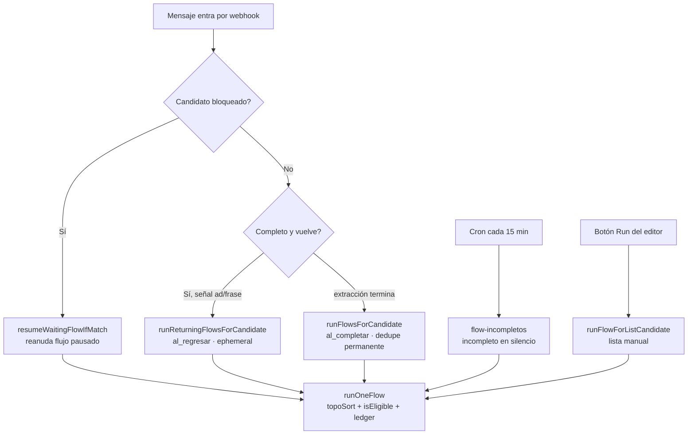

# Auditoría del Sistema de Flujos — Candidatic IA

> **Autor:** Auditoría técnica (rol CTO) · **Fecha:** 2026-09-01 · **Alcance:** motor de flujos completo (backend + editor React).
> **Estado del código auditado:** rama `main`, commit `a705cf39`.
>
> Este documento tiene dos propósitos:
> 1. **Mapa de arquitectura** para que cualquier intervención futura entienda el sistema sin releer 5,000 líneas.
> 2. **Hallazgos priorizados** con severidad, para reducir errores sin introducir parches.
>
> **Decisión 2026-09-01:** se evaluaron los fixes propuestos (H-1, H-3, H-4) y se decidió **NO aplicarlos por
> ahora** — ninguno corrige un problema que hoy afecte a producción; su impacto es de bajo/nulo alcance y solo
> se materializa en casos muy específicos (ver la columna "¿No hacerlo perjudica?" en cada hallazgo). El código
> del motor queda **intacto**. Este documento se conserva como referencia; los hallazgos quedan registrados por
> si algún día su caso se vuelve real.

---

## 1. Veredicto ejecutivo

El sistema de flujos está **bien diseñado y notablemente bien documentado**. Es un motor de ejecución
**determinista, idempotente y retomable** — no un montón de scripts sueltos. Las decisiones difíciles
(idempotencia por candidato/flujo, reanudación tras pausa, cadencia por evento vs. cron, paced-send para
no atropellar a Meta) ya están tomadas y comentadas con su porqué e incidente de origen.

**No hay bugs críticos abiertos.** Los hallazgos de esta auditoría son de fiabilidad de segundo orden
(fugas menores de llaves, ventanas de caché, inconsistencias de simetría, ausencia de pruebas). Ninguno
justifica una reescritura. La palanca de mayor impacto NO es cambiar el motor, es **cubrirlo con pruebas
unitarias** — es un motor casi 100% de funciones puras y hoy no tiene ni una prueba automatizada.

**Recomendación de fondo:** no reescribir. Endurecer con: (a) suite de tests del motor, (b) los 4 fixes de
consistencia de la §6, (c) un validador de grafo en el editor. Todo incremental, todo reversible.

---

## 2. Mapa de arquitectura

### 2.1 Archivos y responsabilidades

| Archivo | Líneas | Rol |
|---|---:|---|
| `api/utils/flow-engine.js` | 1,214 | **Corazón.** Ejecución del grafo, idempotencia, todos los tipos de nodo, los 3 disparadores en vivo. |
| `api/flows.js` | 369 | API REST (CRUD, test, run manual, contadores, métricas por etiqueta). |
| `api/cron/flow-incompletos.js` | 202 | Único cron: dispara flujos de "incompleto en silencio" cada 15 min. |
| `api/ai/agent.js` | — | **3 puntos de enganche** (ver §2.3). El motor no se llama desde ningún otro lado en vivo. |
| `api/whatsapp/webhook.js` | — | Siembra `vacanteActual` y la marca transitoria `return:adclick` en cada click de anuncio. |
| `src/components/flows/*` | ~2,300 | Editor visual (React Flow): lienzo, drawer de config, nodos, aristas, métricas. |
| `src/services/flowsService.js` | 215 | Cliente HTTP del editor. |

### 2.2 Los tres tipos de flujo (por nodo raíz)

El nodo raíz define **cómo y cuándo** se dispara el flujo. Es la abstracción central:

| Nodo raíz | Disparo | Dedupe | Path de código |
|---|---|---|---|
| `inicio` | **Evento en vivo.** Al completar extracción (`al_completar`) y/o al regresar un completo (`al_regresar`). | Permanente (`flow:executed`) para `al_completar`; cadencia (`flow:return:*`) para `al_regresar`. | `runFlowsForCandidate` / `runReturningFlowsForCandidate` |
| `inicio_lista` | **Manual.** Botón "Run" del editor, uno por candidato de una lista filtrada. | Permanente (`flow:executed`), con opción `force` desde el chat. | `runFlowForListCandidate` |
| `inicio_incompleto_silencio` | **Cron.** Candidato incompleto que lleva N horas sin responder. | Cadencia por pases (`flow:silence:*`), no permanente. | `runFlowForIncompleteSilence` |

Además, el nodo `esperando_respuesta` introduce un cuarto modo: **pausa y reanudación**. Un flujo se
detiene en ese nodo (registra `flow:waiting`) y reanuda cuando el candidato manda una frase que coincide
(`resumeWaitingFlowIfMatch`, enganchado en el BLOCK SHIELD del agente).

### 2.3 Puntos de enganche en `agent.js`

Solo tres, todos aislados y `.catch`-eados (nunca tumban al extractor):

1. **`resumeWaitingFlowIfMatch`** (línea ~1316, dentro del BLOCK SHIELD): candidato bloqueado (Brenda muda)
   manda mensaje → si hay flujo pausado esperando frase, reanuda. Brenda sigue callada (no hay doble respuesta).
2. **`runReturningFlowsForCandidate`** (línea ~4457): completo que vuelve, ANTES de la Sala de Espera. Si un
   flujo `al_regresar` aplica, calla al extractor (`isHostMode = true`) para que hable el flujo. `await` real
   (necesita saber si disparó antes de decidir el silencio); el envío corre en segundo plano.
3. **`runFlowsForCandidate`** (línea ~5404): flanco de subida a `paso2Estado === 'completo'`. Corre dentro de
   `runInBackground` (waitUntil) junto con KATCON y el agente en vivo.

### 2.4 Modelo de datos (inventario completo de llaves Redis)

Todas las llaves versionadas con `:v1:`. Sin esto no se puede razonar sobre consumo ni limpieza:

| Llave | Tipo | Contenido | Ciclo de vida |
|---|---|---|---|
| `flows:v1` | string (JSON) | Array de todos los flujos (nodes/edges). Fuente de verdad. | Persistente. Cacheado (`getCachedConfig`, TTL ≤5 min). |
| `flow:executed:v1:<flowId>` | set | Candidatos que COMPLETARON el flujo (dedupe permanente). | Se borra en DELETE. |
| `flow:counter:v1:<flowId>:<nodeId>` | set | Candidatos que pasaron por un nodo Contador (total histórico). | Se borra en DELETE. |
| `flow:counter:ts:v1:<flowId>:<nodeId>` | zset | member=candidato, score=ms del primer paso. Desglose por fecha. | Se borra en DELETE. |
| `flow:progress:v1:<flowId>:<candId>` | hash | Ledger nodeId→'1'/'0' para RETOMAR corrida a medias. | TTL 7 días; se borra al completar. |
| `flow:lock:v1:<flowId>:<candId>` | string | Lock de exclusión mutua por corrida. | TTL 130s (auto-libera). |
| `flow:waiting:v1:<candId>` | hash | field=flowId, value=JSON{nodeId,grupos,matchMode,expiresAt}. Esperas activas. | TTL = ventana de espera + 1 día. |
| `flow:silence:count:v1:<flowId>` | hash | candId→nº pases (cron incompletos). | Reset en activar; borra en DELETE. |
| `flow:silence:lastfire:v1:<flowId>` | hash | candId→ms último disparo (cron incompletos). | Reset en activar; borra en DELETE. |
| `flow:return:count:v1:<flowId>` | hash | candId→nº disparos (al_regresar). | **⚠️ NO se limpia en DELETE ni reset en activar** (ver §6-A). |
| `flow:return:lastfire:v1:<flowId>` | hash | candId→ms último disparo (al_regresar). | **⚠️ NO se limpia en DELETE ni reset en activar** (ver §6-A). |
| `return:adclick:v1:<candId>` | string | Marca transitoria: este turno vino de un click de anuncio. | TTL 600s; la consume el despachador de regreso. |

### 2.5 Algoritmo de ejecución (`runOneFlow`)

El núcleo. Recorre el grafo en **orden topológico** (`topoSort`) y resuelve cada nodo a un `outcome`:
`'pass'` (cumplió/ejecutó), `'fail'` (alcanzado pero no cumplió), `'unreached'` (nunca elegible).

**Elegibilidad (`isEligible`)** — la lógica más sutil del motor:
- Sin aristas entrantes → solo arrancan los nodos de entrada (`ENTRY_NODE_TYPES`). Un nodo suelto NO corre.
- Aristas normales ("Sí"/sin handle) → **AND**: todos los orígenes deben `pass`. (Implementa el fan-in del
  boceto: etiqueta → [edad, municipio, categoría, escolaridad] → mandar WhatsApp).
- Aristas "No cumple" (`handle === 'no'`) → **OR**: basta que un origen haya `fail`.
- Ramas de nodos multi-salida ya reanudados (`branchTaken`) → OR sobre el handle tomado.

**Idempotencia y reanudación:**
1. Si el candidato ya está en `flow:executed` → no hace nada (salvo `ephemeral`/`force`).
2. Toma `flow:lock` NX; si otra invocación lo tiene → no hace nada.
3. Nodos ya en el ledger `flow:progress` se **saltan** (reusan resultado, no re-ejecutan → no re-envían).
4. Al terminar el grafo: `sadd flow:executed` + borra ledger.
5. El nodo `esperando_respuesta` devuelve `{__pause}` → marca el nodo hecho, alarga TTL, y sale SIN completar.

### 2.6 Diagrama de flujo de disparo

---

## 3. Fortalezas confirmadas (no tocar)

- **Idempotencia real, no de papel.** Lock NX + ledger de progreso + dedupe permanente. Verificado que la
  reanudación no re-envía WhatsApp.
- **Ejecución en segundo plano correcta** (`runInBackground`/waitUntil): resuelve el bug histórico de
  congelamiento serverless (ver `project_crm_links_race_fix`).
- **Flujos `al_completar` corren en secuencia sobre UN objeto candidato compartido** → evita el pisado de
  `updateCandidate` read-modify-write que existía con `Promise.allSettled`.
- **Reintento en envíos** (`sendUltraMsgMessageWithRetry`) + paced-send de 450ms → mitiga la pérdida bajo ráfaga.
- **Zona horaria explícita** en todo el cálculo de recordatorios (`resolveReminderSendAt`, offset Monterrey fijo).
- **Limpieza sin `SCAN`**: DELETE borra llaves conocidas por flowId/nodeId (barato, no escanea keyspace).
- **Cobertura determinista del cron** (top-N por último mensaje, no `srandmember` de lotería).

---

## 4. Hallazgos priorizados

Severidad: 🔴 alta · 🟡 media · 🟢 baja/documental.

### 🟡 H-1 · Fuga de llaves y cadencia no reseteada en flujos "al regresar"
`api/flows.js` DELETE (línea 344) limpia `flow:executed`, `flow:counter*` y `flow:silence:*`, pero **NO**
`flow:return:count:v1:<id>` ni `flow:return:lastfire:v1:<id>`. Al borrar un flujo `al_regresar`, esos dos
hashes quedan huérfanos para siempre. Además, `becomingActive` (línea 327) resetea la cadencia de los flujos
de silencio pero **no** la de los de regreso → reactivar un flujo `al_regresar` NO da "campaña limpia" (un
candidato que ya agotó `maxReturns` sigue bloqueado). Inconsistencia con el invariante documentado.
**Impacto:** fuga menor de memoria + comportamiento sorpresa al reactivar. **Fix:** §6-A.

### 🟡 H-2 · Ventana de hasta 5 min para que un flujo editado/activado surta efecto en vivo
Los tres paths en vivo leen `flows:v1` vía `getCachedConfig` (TTL ≤5 min). `saveFlows` llama
`invalidateCache`, pero eso solo purga la caché en memoria **de la instancia serverless que guardó** — las
demás instancias sirven la versión vieja hasta que expira el TTL. Un flujo recién activado puede no disparar
(o disparar con reglas viejas) durante unos minutos en instancias frías/distintas.
**Impacto:** confusión al probar ("lo activé y no corrió"). El nodo Test ya lee directo, así que no afecta la
prueba, solo producción en vivo. **Fix:** §6-B (invalidación por pub/sub o `flowsVersion`).

### 🟢 H-3 · Inconsistencia dangling-edge entre `topoSort` y `buildIncomingMap`
`topoSort` ignora aristas cuyo `source`/`target` no exista en `nodes` (chequea `adj.has`/`inDegree.has`), pero
`buildIncomingMap` las conserva tal cual. Un nodo con una arista entrante huérfana (origen borrado) quedaría
`unreached` **para siempre** porque su dependencia nunca llega a `'pass'`. Hoy es latente: el editor borra las
aristas al borrar un nodo, y clone/paste filtran aristas sin ambos extremos. Pero es una inconsistencia real
que un JSON manipulado o un bug futuro del editor activaría. **Fix:** §6-C (una línea).

### 🟢 H-4 · `frase_dinamica` vinculada pierde su valor "en vivo" al reanudar tras pausa
Al reanudar un flujo pausado en `esperando_respuesta`, el reuse del ledger re-aplica solo `node.data.value`
(texto manual), no vuelve a resolver `linkedQuickReplyId` contra el banco (líneas 923-925). Un WhatsApp
posterior a la pausa que dependa de una frase dinámica **vinculada** usaría el fallback manual (o vacío).
**Impacto:** bajo (requiere frase dinámica vinculada + nodo esperando_respuesta después, en el mismo flujo).
**Fix:** §6-D o documentar la limitación en el drawer del nodo.

### 🟢 H-5 · Sin validación de grafo: ciclos y ramas muertas son silenciosos
`topoSort` descarta en silencio los nodos en ciclo o desconectados de la raíz (comportamiento correcto para no
tumbar la corrida). Pero el editor **no avisa** al reclutador que parte de su flujo nunca se ejecutará. Tampoco
señala el "AND accidental": conectar dos ramas independientes a una misma acción con aristas normales exige que
AMBAS pasen (fan-in AND), lo que sorprende a quien esperaba un OR.
**Impacto:** errores de configuración invisibles hasta que "no llegó el mensaje". **Fix:** §6-E (linter no bloqueante).

### 🟢 H-6 · Semántica del Contador: cuenta "llegó al nodo", no "entrega exitosa"
Los nodos de acción devuelven `true` aunque el envío de WhatsApp falle (decisión intencional y correcta: no
dejar la cadena a medias). Consecuencia colateral: el nodo **Contador** cuenta candidatos que *pasaron* por el
nodo, no entregas confirmadas. Para métricas de negocio conviene aclararlo en la UI. El fallo ya se loguea con
contexto `[FLOW-ENGINE] ... envío falló`. **Impacto:** interpretación errónea de métricas. **Fix:** documental
(tooltip) o contador de fallos separado.

### 🟢 H-7 · Asimetría entre el path `al_completar` y `al_regresar`
`runFlowsForCandidate` comparte un `candidate` y un `opts` entre todos los flujos (paced-send global +
etiquetas visibles entre flujos). `runReturningFlowsForCandidate` corre cada flujo con snapshot fresco
`{...candidateSnapshot}` y sin `opts` compartido. Si dos flujos `al_regresar` aplican a la vez, no comparten la
pausa entre envíos ni ven las etiquetas que el otro agregó. **Impacto:** bajo (apilar flujos de regreso es
raro). **Fix:** unificar el patrón de `runFlowsForCandidate` en el path de regreso.

### 🟢 H-8 · Cobertura del cron bajo pico alto
`flow-incompletos.js`: `RECENT_LIMIT=100` evaluados, `MAX_FIRES_PER_RUN=25`. Si en una ventana de 15 min entran
>100 recientes elegibles, los de más abajo se rezagan. Documentado como aceptable; solo relevante a alto
volumen. **Fix:** ninguno hasta que el volumen lo exija (subir `RECENT_LIMIT`, o paginar).

### 🟢 H-9 · Cero pruebas automatizadas (la palanca #1 de fiabilidad)
No existe ninguna prueba del motor. Sin embargo, sus piezas clave son **funciones puras o casi**: `topoSort`,
`buildIncomingMap`, `isEligible` (extraíble), `flowTextMatchesGroup`, `normalizeFlowText`,
`resolveReminderSendAt`, `getCandidateAge`, `getInicioTrigger`. Son testeables sin Redis ni Meta. Una suite
aquí atrapa regresiones de la lógica AND/OR y de idempotencia mejor que cualquier revisión manual.
**Fix:** §6-F.

### ✅ Verificado, NO es bug
- `getCandidateAge`: arma la fecha de nacimiento con `Date` local (UTC en el server) y compara contra `new
  Date()` también local — consistente internamente, solo compara Y/M/D, sin desfase de zona.
- Reserva de cadencia ANTES de ejecutar en `al_regresar`/cron: es **at-most-once a propósito** (un envío
  fallido consume un pase) — evita duplicados, patrón coherente entre ambos disparadores.
- Concurrencia del mismo candidato: serializada aguas arriba por el lock por-candidato de `process-message.js`
  (hasta 50s), más el `flow:lock` NX — doble candado.

---

## 5. Riesgo arquitectónico heredado (contexto, no acción)

El motor corre **dentro de la petición del webhook** vía `waitUntil`/`runInBackground`. Un flujo con muchos
nodos "Mandar WhatsApp" hace envíos secuenciales con pausa de 450ms; sumado al `maxDuration` de 120s y a la
espera de lock de `process-message.js` (hasta 50s), un flujo muy largo podría acercarse al límite. Es el mismo
riesgo documentado en `CLAUDE.md` (desacoplar el ack de Meta del procesamiento). **No materializado hoy.** Si
los flujos crecen mucho en número de envíos, esta es la primera pieza a vigilar.

---

## 6. Plan de endurecimiento recomendado (incremental, reversible)

Ordenado por relación impacto/riesgo. Ninguno es una reescritura; todos son cambios acotados.

**A. Cerrar la fuga y simetrizar la cadencia de "al regresar"** (H-1) — *~6 líneas, riesgo nulo.*
En `api/flows.js`: agregar `flow:return:count:v1:<id>` y `flow:return:lastfire:v1:<id>` al `cleanupPipeline` del
DELETE, y al `redis.del` de `becomingActive`.

**B. Invalidación inmediata de `flows:v1`** (H-2) — *riesgo bajo.*
Publicar en `channel:sse:updates` (o un canal propio) al guardar un flujo, y que cada instancia purgue su caché
al recibirlo; o versionar con un contador `flows:version` que los paths en vivo chequeen barato. Alternativa
mínima: leer directo (sin caché) en `runFlowsForCandidate` — el costo es 1 GET por candidato completado (evento
poco frecuente), aceptable.

**C. Filtrar aristas huérfanas en `buildIncomingMap`** (H-3) — *1 línea, riesgo nulo.*
Recibir el set de nodeIds válidos y descartar aristas cuyo `source`/`target` no exista, igual que hace
`topoSort`. Elimina la inconsistencia de raíz.

**D. Re-resolver frase dinámica vinculada al reanudar** (H-4) — *riesgo bajo.*
En el reuse del ledger, para `frase_dinamica` con `linkedQuickReplyId`, re-leer la frase del banco (como en la
ejecución normal) en vez de solo `node.data.value`.

**E. Linter de grafo en el editor** (H-5) — *feature nueva, no toca el motor.*
Al guardar/activar, advertir (no bloquear) sobre: nodos de acción inalcanzables desde la raíz, ciclos, y fan-in
AND de ramas independientes. Warning visual, el reclutador decide.

**F. Suite de pruebas del motor** (H-9) — *la de mayor ROI.*
Unit tests de las funciones puras + casos de `runOneFlow` con un doble de Redis en memoria: idempotencia (no
re-envía), reanudación (retoma en el nodo correcto), ramas Sí/No, fan-in AND. Es la mejor defensa contra
regresiones futuras.

---

## 7. Guía rápida para futuras intervenciones

- **Agregar un tipo de nodo:** (1) `case` en `evaluateOrExecute` (retorna `true` si es acción, booleano si es
  condición); (2) entrada en `NODE_DEFS` (nodeDefs.js) con `branching:true` si tiene rama Sí/No; (3)
  `DEFAULT_DATA_BY_TYPE` en FlowEditor.jsx; (4) UI en NodeConfigDrawer.jsx. **Regla de oro:** las acciones
  SIEMPRE retornan `true` (no rompen la cadena si el efecto externo falla) y mantienen el snapshot en memoria
  del candidato en sync (`Object.assign`/`candidate.x = ...`) para el resto de la corrida.
- **Agregar un disparador:** espeja el patrón de `runReturningFlowsForCandidate` (event-driven) o del cron
  (barrido). Nunca llames al motor sin pasar por `runOneFlow` (es quien garantiza idempotencia y lock).
- **Nuevas llaves Redis:** versiónalas `:v1:`, agrégalas al inventario (§2.4) Y a la limpieza del DELETE.
- **Cambios de zona horaria/fechas:** usa `resolveReminderSendAt`/`reminder-schedule.js`, nunca `setHours` sobre
  la hora del server (es UTC en Vercel — bug histórico documentado).
- **Verificación:** `node --check` de los 3 archivos backend; prueba contra un candidato real vía el nodo Test
  (lee directo, sin caché); confirma con lectura directa de Redis (MONITOR pierde comandos <1s).

---

## 8. Estado de los hallazgos (2026-09-01)

Durante esta sesión se prototiparon y probaron los fixes H-1, H-3, H-4 (más una suite de 40 pruebas y la
extracción de `isNodeEligible`/`isSilenceCandidateEligible` como funciones puras). Tras evaluar el impacto
real, **se decidió NO integrarlos**: ninguno corrige un problema que hoy afecte a producción y el motor
actual funciona bien. El código quedó **revertido a su estado original** (`git checkout`) para no tocar un
sistema estable sin un beneficio tangible.

Los hallazgos siguen **abiertos y documentados** aquí. Si en el futuro alguno se vuelve relevante, este es el
mapa para retomarlo:

| Hallazgo | Se vuelve relevante cuando… | Dónde está |
|---|---|---|
| H-1 | Se usen flujos "al regresar" y se apaguen/reactiven esperando campaña limpia | `api/flows.js` (DELETE + `becomingActive`) |
| H-3 | El editor deje una arista huérfana, o se edite el JSON del flujo a mano | `buildIncomingMap` en `flow-engine.js` |
| H-4 | Un flujo combine frase dinámica vinculada + nodo "Esperando Respuesta" | reuse del ledger en `runOneFlow` |
| H-2 | Molesten los minutos de retraso al activar un flujo (caché ≤5 min) | los 3 paths en vivo leen `flows:v1` con caché |
| H-5 | Se quieran evitar errores de configuración silenciosos en el editor | validación al guardar en `FlowEditor.jsx` |
| H-9 | Se retome cualquier fix del motor → conviene una suite que blinde la lógica AND/OR e idempotencia | (no integrada) |

**Recomendación abierta:** el mayor valor a futuro sigue siendo una suite de pruebas (H-9), porque no cambia
producción y protege contra regresiones la próxima vez que se toque el motor. No se integró en esta sesión
por decisión de mantener el árbol intacto.

---

*Fin de la auditoría. Cualquier fix de la §6 se puede aplicar de forma independiente, cada uno con su commit,
si su caso se vuelve real.*
